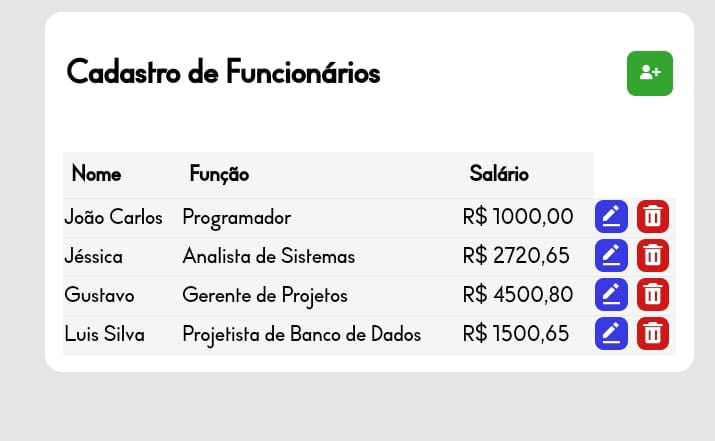
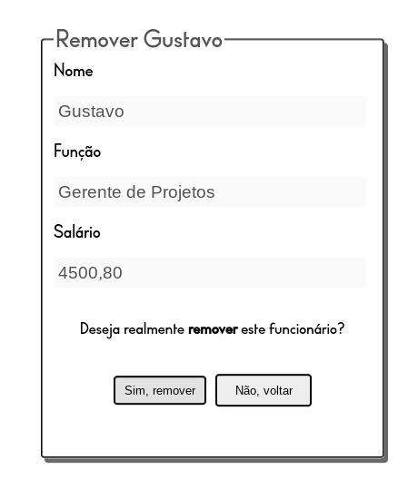

# Sistema de Gerenciamento de Funcionários com NodeJS e MySQL


<div>


</div>

## ➢ Sobre o Projeto

<ul>
    <li>Este projeto consiste em uma aplicação CRUD fictícia de cadastro de diferentes funcionários.</li>
    <li>É possível que o usuário inclua, consulte, edite ou remova funcionários da base de dados do site. </li>
    <li> Desenvolvido utilizando as seguintes linguagens/ferramentas: 
        <ul>
            <li> <strong>NodeJS</strong> como linguagem back-end </li>
            <li> <strong>Framework ExpressJS</strong> para a construção do servidor</li>
            <li> <strong>Middleware Functions do Express-validator</strong> para a validação de dados do usuário</li>
            <li><strong>Template Engine EJS</strong> para renderizar as páginas de forma dinâmica</li>
            <li><strong>Linguagem CSS</strong> para estilizar as páginas e criar um design mais agradável e responsivo</li>
            <li><strong>Biblioteca Boxicons</strong> para adicionar ícones em telas de dispositivos móveis</li>
            <li><strong>Dependências Mysql2 e dotenv</strong> para realizar a conexão do Servidor com o Banco de Dados</li>
            <li> <strong>Linguagem MySQL</strong> para a construção do Banco de Dados</li>
            <li> <strong>Plataforma Render</strong> para a hospedagem da aplicação na nuvem.</li>
            <li> <strong>Plataforma Clever Cloud</strong> para a hospedagem do Banco de Dados</li>
        </ul>
    </li>
</ul>

### ➢ Acesso

<p> Você pode acessar a página através deste link: https://crud-node-2rip.onrender.com </p>

<p>Caso o link acima não esteja disponível, você pode acessar localmente em sua máquina, seguindo os seguintes passos:</p>
<ul>
    <li> Baixe o repositório e extraia os arquivos</li>
    <li> No terminal, execute os comandos:</li>

```shell
npm install
node app.js   
```


<li>Acesse em um navegador pelo endereço <b>localhost:3000</b></li>
</ul>


