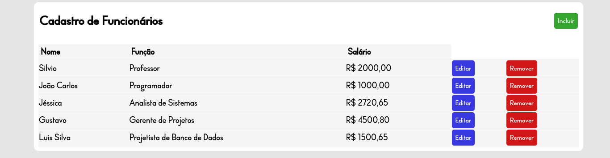

# CRUD com NodeJS



## Sobre o Projeto

<ul>
    <li>Este projeto consiste em uma aplicação CRUD fictícia de cadastro de diferentes funcionários.</li>
    <li>É possível que o usuário inclua, consulte, edite ou remova funcionários da base de dados do site. </li>
    <li> Desenvolvido utilizando as seguintes linguagens/ferramentas: 
        <ul>
            <li> <strong>NodeJS</strong> como linguagem back-end
            <li> <strong>Framework ExpressJS</strong> para a construção do servidor
            <li> <strong>Middleware Functions do Express-validator</srong> para a validação de dados do usuário
            <li> <strong>Linguagem MySQL</strong> para a construção do Banco de Dados
            <li> <strong>Plataforma Render</strong> para a hospedagem da aplicação na nuvem.
            <li> <strong>Plataforma Clever Cloud</strong> para a hospedagem do Banco de Dados
        </ul>
    </li>
</ul>

### Acesso

<p> Você pode acessar a página através deste link: https://crud-node-2rip.onrender.com </p>

<p>Caso o link acima não esteja disponível, você pode acessar localmente em sua máquina, seguindo os seguintes passos:</p>
<ul>
    <li> Baixe o repositório e extraia os arquivos
    <li> No terminal, execute os comandos:

```shell
npm install
node app.js   
```


<li>Acesse em um navegador pelo endereço <b>localhost:3000</b></li>
</ul>
